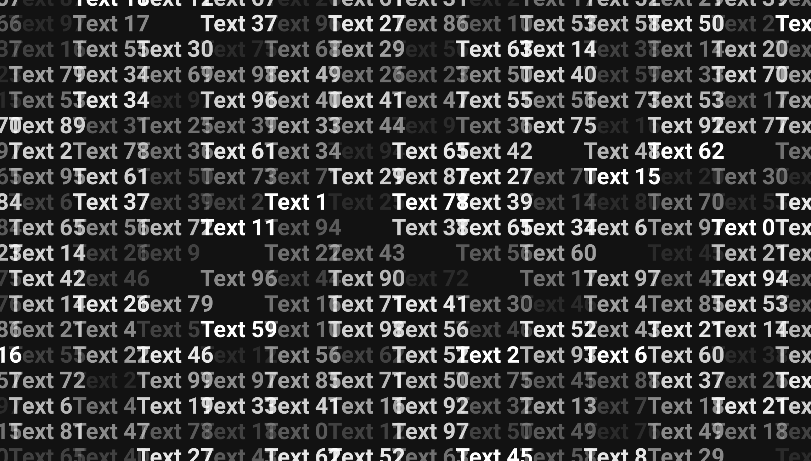
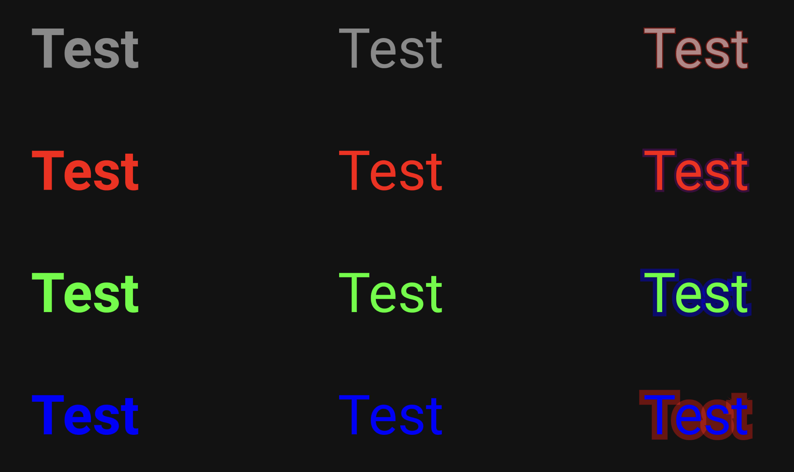
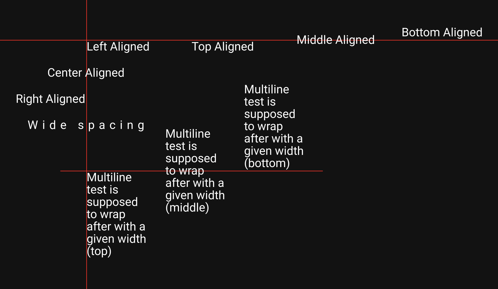

# thomas


thomas is an high-performance 2D/3D text rendering engine for [react-three-fiber](https://github.com/pmndrs/react-three-fiber). It can leverage instancing, vertex pulling and multichannel signed distance fields to render hundreds of thousands of characters with a single draw call, without compromising performance. It offers an easy-to-use React-friendly API.

```bash
npm install thomas
```

Try our [demo here](https://thomas-the-text-engine.netlify.app)!

## API for 2D Text Rendering

thomas provides high quality instanced rendering for 2D quads with text, using multichannel signed distance fields.

<div style="display:flex;align-items:center;gap:4px">
  
  
  
</div>

```tsx
// Provides the paths to the font to the provider, should be served by your webserver
const fontPathRegular = {
  sdfPath: '/robotoRegular2D/roboto-regular.png',
  fontPath: '/robotoRegular2D/roboto-regular.fnt',
}
// Optional
const fontPathBold = {
  sdfPath: '/robotoBold2D/roboto-bold.png',
  fontPath: '/robotoBold2D/roboto-bold.fnt',
}

function Text2D() {
  // Optional, for imperative mutations
  const textRef = useRef<SDFTextRefType>(null)
  // You can then call textRef?.setTransform(matrix)

  return (
    // Wrap your text components with this provider
    <SDFTextProvider
      fontPathRegular={fontPathRegular}
      // Optional
      fontPathBold={fontPathBold}
    >
      {/* SDFText will get the transforms from the parent */}
      <group position={[10, 0, 0]}>
        <SDFText
          // The text to be displayed
          text="Example text"
          // An unique key for this instance
          instanceKey="unique_key"
          // Optional styling props
          bold={false}
          color={new Color('#ff0000')}
          opacity={0.5}
          outlineWidth={0.13}
          outlineOpacity={0.4}
          outlineColor={new Color('#0000ff')}
          // Optional layouting props
          alignX="left" // 'left' | 'center' | 'right'
          alignY="top" // 'top' | 'middle' | 'bottom'
          letterSpacing={32}
          width={500}
          lineHeight={10}
          yShift={0}
          // Gets called before updating, useful for applying imperative updates
          onBeforeUpdate={updateFunction}
          // You can also get a ref to apply imperative mutations
          ref={textRef}
        />
      </group>
    </SDFTextProvider>
  )
}
```

## Acknowledgements

- [drei](https://github.com/pmndrs/drei) for the library setup
- [three-msdf-text](https://github.com/leochocolat/three-msdf-text) for the MSDF implementation
